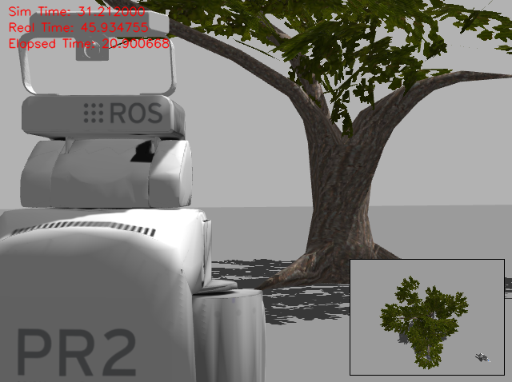

gazebo_video_monitor_plugins
---

gazebo_video_monitor_plugins provides a gazebo multicamera sensor which can be used for creating different types of videos with multiple views in the gazebo world.

GazeboVideoMonitorPlugin
---

The GazeboVideoMonitorPlugin plugin records videos in the following format.



It assumes two cameras: one which can be used to get a view of the world, and another one which can be attached to a robot to get a view from its perspective. Additionally, time metadata are logged in the video to make tracking of events, relating to the world and the robot, easier.

To configure the plugin, have a look at the [gazebo_video_monitor_plugin.world](test/worlds/gazebo_video_monitor_plugin.world) file.

The plugin exposes two ROS services to control the recordings.

Use the start_recording service to initiate a recording. Setting disable_window to true removes the second view from the recording. world_as_main_view can be used to set the world or robot camera as the main view of the recording.

```bash
rosservice call /gazebo/start_recording "{disable_window: false, world_as_main_view: false}"
```

Use the stop_recording service to save or discard a recording. The filename must be given without the extension (.mp4). The recording is saved in the directory defined in the plugin configuration.

```bash
rosservice call /gazebo/stop_recording "{discard: false, filename: navigation-test}"
```

Camera Configuration
---

All plugins expose a set_camera ROS service for configuring the pose of a camera, and the link to which the camera should be attached. You can enable the camera visualizations in the plugin configuration to make this process easier.

```bash
rosservice call /gazebo/set_camera "{camera_name: robot_camera, model_name: robot-0001, link_name: gripper_link, pose: {x: 0.0, y: -0.05, z: -0.1, roll: -0.2, pitch: 0.0, yaw: 0.0}}"
```

Known Issues
---

* The camera visualizations (not the cameras used for recording) are created and set correctly, but they don't get attached to the models.
* The robot camera of GazeboVideoMonitorPlugin is not always moved correctly during initialization. The numberOfInitialAttachRetries parameter was introduced as a temporary fix.
